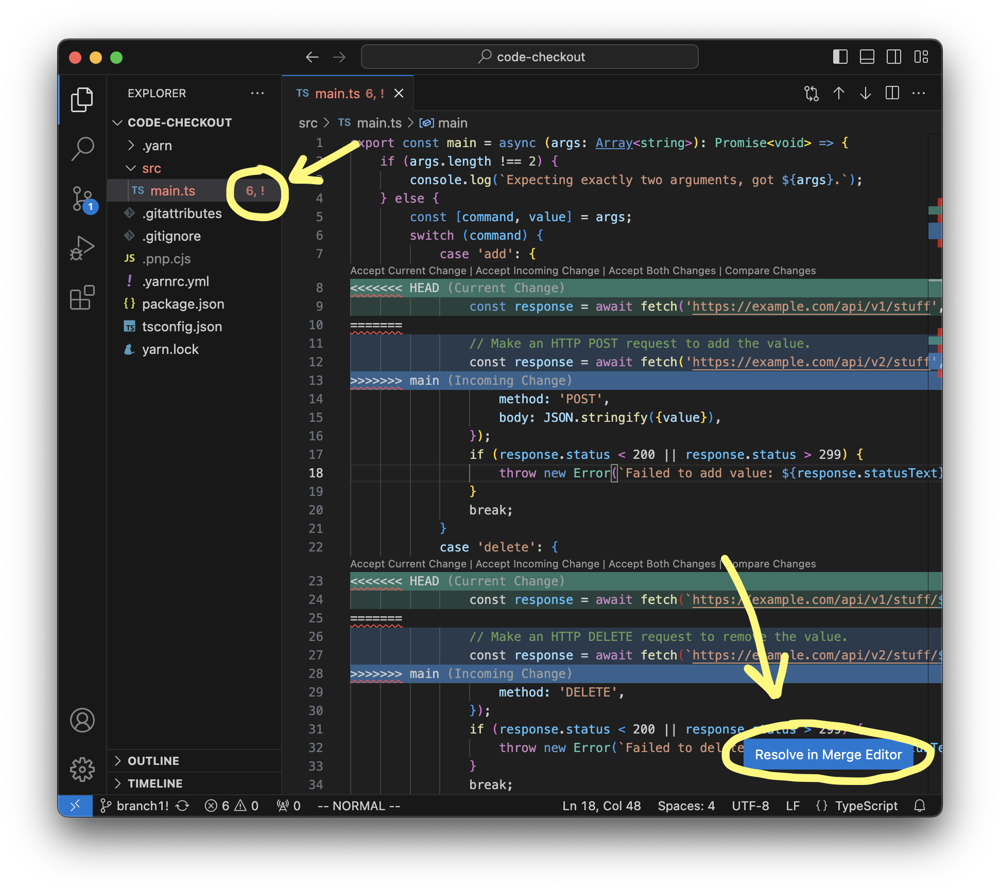

# VSCode: Git 3-way merge tool instructions

## Launching the 3-way merge tool

Let's say you've just done a `git merge` or `git rebase` and Git says there are conflicts you need to resolve.

Open the source file. On the bottom right, you should see a button that says "Resolve in Merge Editor". Click that button.

## Using the 3-way merge tool

VSCode documentation: https://code.visualstudio.com/docs/sourcecontrol/overview#_3way-merge-editor
