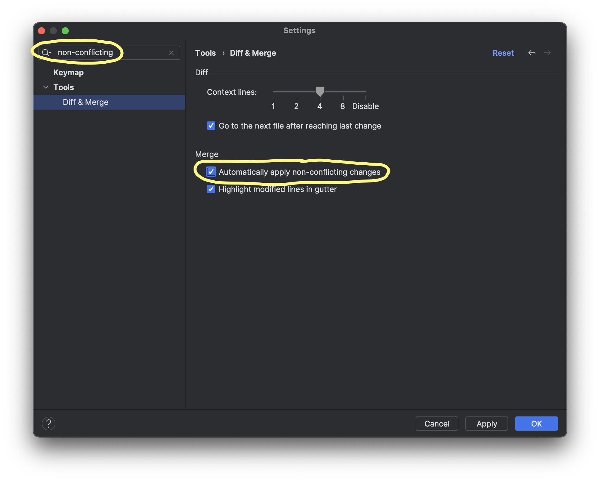

# WebStorm: Git 3-way merge tool instructions

## Enable "Automatically apply non-conflicting changes"

1. Open IDE settings.
2. Type "non-conflicting" into the settings search field.
   - It should find the setting under "Tools" -> "Diff & Merge"
3. Make sure the checkbox is checked next to "Automatically apply non-conflicting changes"

## Launching the 3-way merge tool

Let's say you've just done a `git merge` or `git rebase` and Git says there are conflicts you need to resolve.

Go to the menu bar and select "Git" -> "Resolve Conflicts..."

## Using the 3-way merge tool

JetBrains documentation: https://www.jetbrains.com/help/webstorm/resolve-conflicts.html
